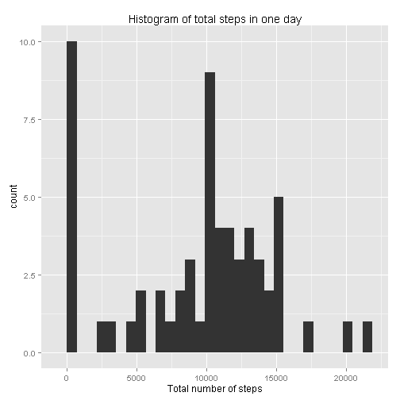
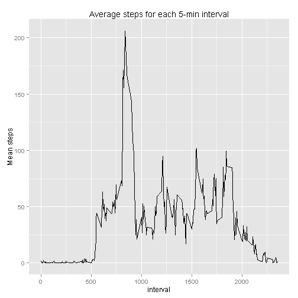
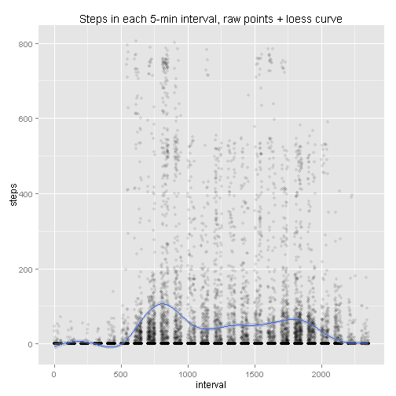
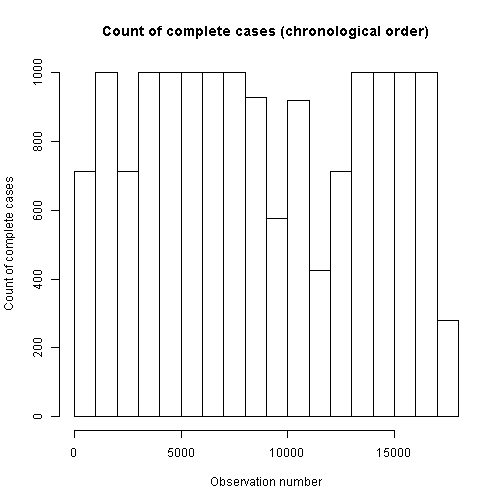
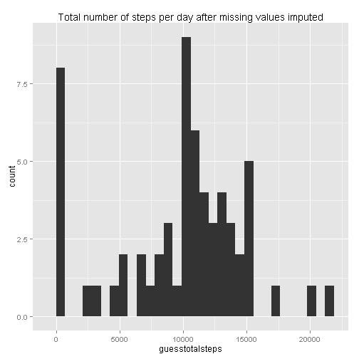
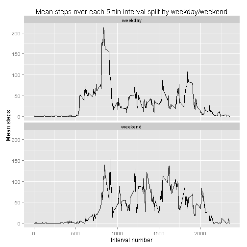

```r
# Include required libraries
library(ggplot2)
library(plyr)
```

## Loading and preprocessing the data

```r
activity<-read.csv("activity.csv",colClasses=c("integer","Date","integer"))
stepsperday<-ddply(activity, c("date"),summarise, totalsteps=sum(steps,na.rm=TRUE))
stepsper5min<-ddply(activity, c("interval"),summarise, meansteps = mean(steps,na.rm=TRUE))
```

## What is mean total number of steps taken per day?
Mean total number of steps taken per day = 9354.2295082
Median number of steps taken per day(NA's omitted) = 10395


```r
steps_histogram<-ggplot(stepsperday,aes(x=totalsteps))+geom_histogram()+
  xlab("Total number of steps")+ ggtitle("Histogram of total steps in one day")
print(steps_histogram)
```

```
## stat_bin: binwidth defaulted to range/30. Use 'binwidth = x' to adjust this.
```

 

## What is the average daily activity pattern?

```r
dayline<-ggplot(stepsper5min,aes(x=interval,y=meansteps))+geom_line()+
  ggtitle("Average steps for each 5-min interval")+ ylab("Mean steps")
print(dayline)
```

 

Alternative daily activity pattern visualisation, raw points with a loess curve


```r
dayraw<-ggplot(activity,aes(x=interval,y=steps))+geom_point(alpha=.1)+geom_smooth()+
  ggtitle("Steps in each 5-min interval, raw points + loess curve")
print(dayraw)
```

```
## geom_smooth: method="auto" and size of largest group is >=1000, so using gam with formula: y ~ s(x, bs = "cs"). Use 'method = x' to change the smoothing method.
```

 

The five minute interval with the highest mean step-count is interval #835 with a mean of 206.1698113 steps.  

## Imputing missing values

There are 2304 incomplete records, unevenly distributed through the data.


```r
hist(which(complete.cases(activity)),
     main="Count of complete cases (chronological order)", xlab="Observation number", ylab="Count of complete cases")
```

 
 
Interpolation is using average of previous and next valid observation, or the average for 5-min interval if there is no valid previous/next observation. This produces smooth activity-over-the-day lines for each individual day.
 

```r
step_interpolation <- function(rownumber){
  prevrow=rownumber;
  nextrow=rownumber;
  while(is.na(activity$steps[prevrow])){
    prevrow=prevrow-1
    if(prevrow<1)return(mean(activity[activity$interval==activity$interval[rownumber],"steps"],na.rm=TRUE))
  }
  while(is.na(activity$steps[nextrow])){
    nextrow=nextrow+1
    if(nextrow>nrow(activity))return(mean(activity[activity$interval==activity$interval[rownumber],"steps"],na.rm=TRUE))
  }
  return((activity$steps[prevrow]+activity$steps[nextrow])/2)
}

activity_guessNA <-activity
for(n in 1:nrow(activity)){
  if(is.na(activity$steps[n])){
    activity_guessNA$steps[n]=step_interpolation(n);
  }
}
```

The imputed dataset has comparitively fewer zeros, the original data is peppered with lone zeros and the imputation strategy above just doesn't reproduce this pattern. Most of the imputed entries appear to have been added in the most commonly occuring range.


```r
stepsperday2<-merge(ddply(activity_guessNA, c("date"),summarise, guesstotalsteps=sum(steps,na.rm=TRUE)), stepsperday, by="date")
stepsPerDayHist <- ggplot(stepsperday2,aes(x=guesstotalsteps))+
    geom_histogram()+ ggtitle("Total number of steps per day after missing values imputed")
print(stepsPerDayHist)
```

```
## stat_bin: binwidth defaulted to range/30. Use 'binwidth = x' to adjust this.
```

 

The mean and median total steps are 9354.2295082 and 10395, for the NA-imputed data the mean and median are  9707.219301 and 1.0571 &times; 10<sup>4</sup>. 

## Are there differences in activity patterns between weekdays and weekends?

Looks like activity is higher on the weekends, particularly in the middle of the day, although it is lower early in the morning just after waking.


```r
paindays= c("Monday","Tuesday","Wednesday","Thursday","Friday")
activity_guessNA$weekday<-as.factor(ifelse(weekdays(activity_guessNA$date)%in%paindays,"weekday","weekend"))
stepsperinterval.weekdaysplit<-ddply(activity_guessNA, c("interval","weekday"),summarise, meansteps = mean(steps,na.rm=TRUE))
weekdayplot<-ggplot(stepsperinterval.weekdaysplit,aes(x=interval,y=meansteps))+
  facet_wrap(~weekday,nrow=2,ncol=1)+ geom_line()+
  ggtitle("Mean steps over each 5min interval split by weekday/weekend")+
  ylab("Mean steps")+ xlab("Interval number")
print(weekdayplot)
```

 
